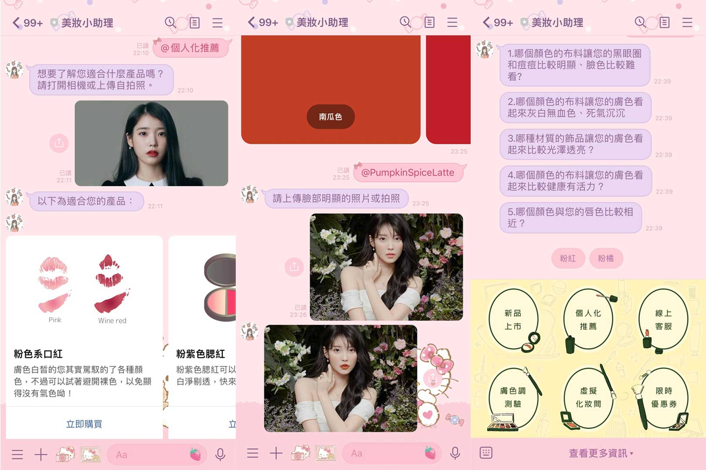

# tibame_virtual_makeup_linebot

## About
This project draws inspiration from the official Line accounts of makeup brands. It combines virtual makeup try-on with personalized cosmetic recommendations, aiming to provide users with a sophisticated and convenient makeup experience.

The virtual makeup component draws reference from Jose Luis Verdugo's Virtual Makeup (OpenCV + Face Landmarks) project. The mask and contouring values have been adjusted to better suit Eastern facial features.

## Watch the Line Bot demo in action
[Line Bot Demo](https://drive.google.com/file/d/14A3ieo-yQx_Q3-hXcvy49Ayww9aawEfz/view?usp=drive_link)

## Acknowledgments
- Virtual Makeup component reference: [Jose Luis Verdugo/Virtual Makeup (OpenCV + Face Landmarks)](https://deepnote.com/@jose-luis-verdugo/Virtual-Makeup-OpenCV-Face-Landmarks-1eeab981-1e5b-45f6-993f-5e087646e7c1)

The project draws upon the work of Jose Luis Verdugo and his Virtual Makeup project, utilizing OpenCV and face landmarks. For further details, please refer to the provided link.
